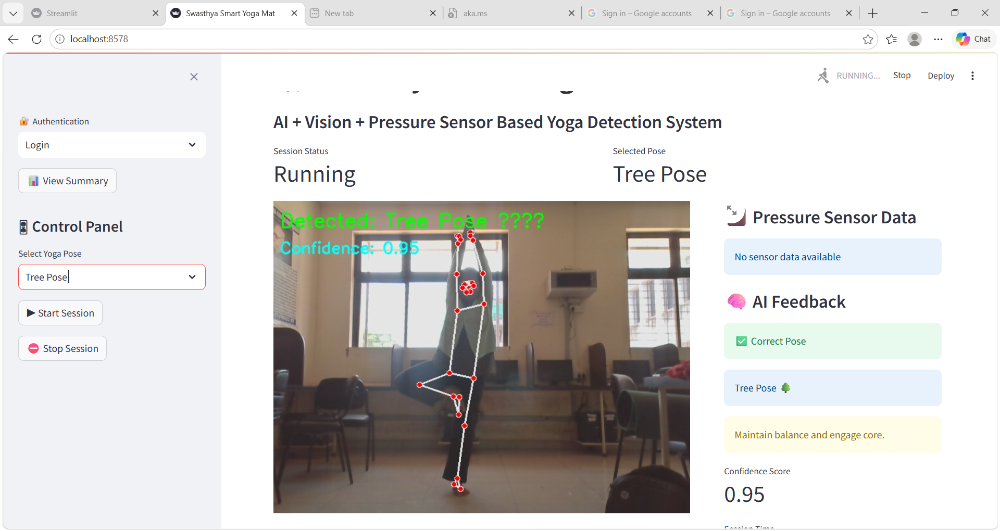
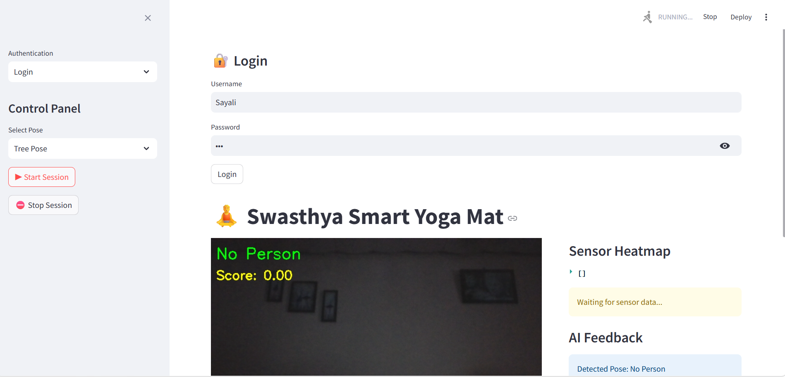

# Swasthya Smart Yoga Mat  
### Final Year BE Project  

---

##  Department  
Department of Computer Engineering  
ABMS Anantrao College of Engineering and Research, Pune  

---

##  Project Group Members

- Sayali Milind Vanjare  
- Abhidnya Santosh Nighot  
- Samartha Ganesh Kajale  
- Suraj Pramod Bobade  

---

##  Project Guide

**Dr. Jitendra Musale**

---

# 🎯 Abstract

Swasthya Smart Yoga Mat is a hybrid intelligent system integrating **Computer Vision, Machine Learning, and IoT sensors** to detect yoga postures in real time and provide corrective feedback. The system enhances posture accuracy, supports injury prevention, and enables structured yoga training through real-time analysis.

---

# 🎯 Objectives

- Real-time yoga posture detection using camera input  
- Sensor-based pressure analysis from smart mat  
- Machine learning-based posture classification  
- Feedback generation for posture correction  
- Session-wise performance tracking and analytics  

---

# ⚙️ Technology Stack

- Python  
- OpenCV  
- MediaPipe  
- Scikit-learn (Random Forest Classifier)  
- NumPy, Pandas  
- Streamlit (User Interface)  
- Matplotlib / Seaborn (Visualization)  
- IoT Pressure Sensors  

---

# 🏗️ System Architecture


## 🧱 Block Diagram  

---

## 🔄 Data Flow Diagram (DFD)  


---

# 🤖 Machine Learning Model

- **Algorithm:** Random Forest Classifier  
- **Input:** Pose landmarks + sensor readings  
- **Output:** Classified yoga posture  
- **Purpose:** Real-time posture recognition and correction  

---

# 📊 Performance Evaluation

## 📌 Confusion Matrix  


---

## 📈 Accuracy per User  


---

## 📉 Latency vs Frequency Graph  


---

# 🖥️ System Screenshots

## 🔐 Login Page  


---

## 📝 Registration Page  


---

## 🧍 Pose Detection Interface  


---

## 📊 Session Dashboard  



---

# 🎥 Demo Video

👉 Live/Hosted Video Link:

https://your-demo-video-link.com

---

# 📁 Project Structure

```text
app.py
auth/
core/
vision/
sensor_input.py
pose_detection.py
feedback.py
session_summary.py
data/
assets/
images/
videos/
requirements.txt
```

## 🚀 Installation & Execution
git clone git@github.com:sayalivanjare/swasthya-smart-yoga-mat.git
cd swasthya-smart-yoga-mat
pip install -r requirements.txt
streamlit run app.py

## 📊 Results Summary
Real-time yoga posture detection successfully implemented
Machine learning model shows stable classification performance
Sensor fusion improves accuracy and reliability
Confusion matrix validates prediction correctness
System operates with acceptable real-time latency

## 🚧 Limitations
Requires proper lighting for accurate camera detection
Sensor calibration may vary across hardware setups
Model accuracy depends on dataset quality and diversity

## 🔮 Future Scope
Deep learning-based pose estimation enhancement
Mobile application integration
Cloud-based user progress tracking system
Wearable IoT integration
AI-based personalized yoga trainer system

## 📌 Conclusion
The Swasthya Smart Yoga Mat successfully demonstrates integration of AI, Computer Vision, and IoT technologies for real-time yoga posture analysis. The system provides meaningful corrective feedback and performance tracking, making it suitable for fitness improvement and rehabilitation applications.
